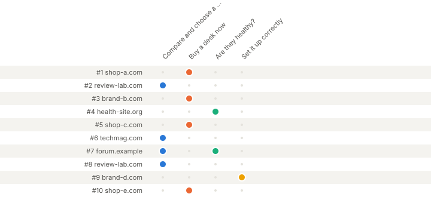
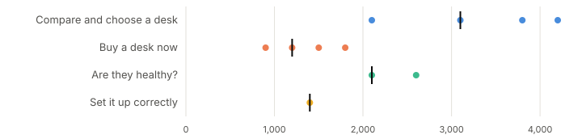
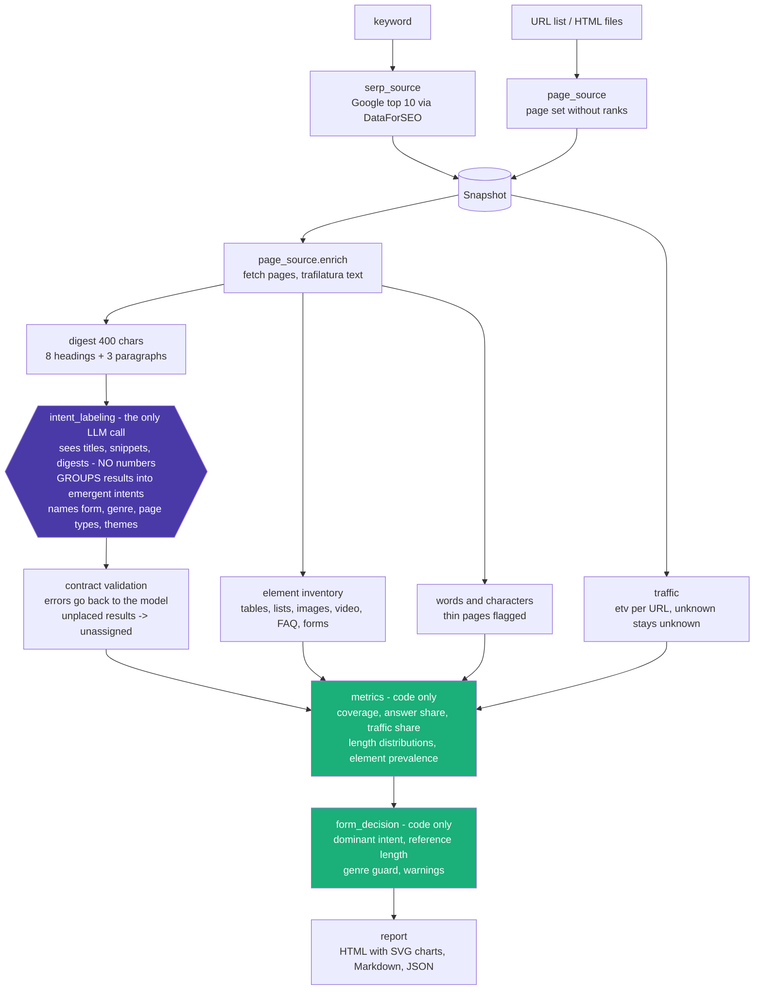

# Intent Labeler

Label the **search intent** behind a Google results page (or any set of web pages) and get a
**recommended content form**: which intents the results serve, how strongly (by results and by
traffic), in what form each is answered, how long the winning pages are, and when the query does not
want an article at all.

**Website and in-browser playground: https://romek-rozen.github.io/intent-labeler/** - bring your own
OpenRouter key (and DataForSEO login for live Google results and page reading in 16 markets; a full
run costs about half a US cent). The page has no server and
stores no keys. Results you choose to make public are proposed as pull requests to
[`community/`](community/).

The method has one rule that makes it trustworthy: **the language model only groups results; every
number is computed by code.** The model says "results r02, r06 and r08 serve the *compare models*
intent". Shares, ranks, medians and the target length are counted from those IDs - the model never
writes a percentage.






*Charts from the bundled synthetic example ([HTML report](docs/example-report.html), [Markdown](docs/example-report.md)).*

**Live examples** in five markets (Google top 10, `openai/gpt-6-luna`, run on 2026-09-30) - each folder has
`report.html`, `report.md`, `analysis.json` and the `snapshot.json` to re-run offline:

| Query | Market | Dominant intent -> form | Reference length | Warnings |
|---|---|---|---|---|
| [zagadki logiczne](examples/zagadki-logiczne/report.md) | PL | Kupno książek z zagadkami -> księgarniane listingi i strony produktów | 537 words | traffic_disagrees, wide_length_band |
| [jak zrobić zakwas na chleb](examples/jak-zrobic-zakwas-na-chleb/report.md) | PL | Zrobić domowy zakwas żytni -> Przepis krok po kroku z harmonogramem dokarmiania i wskazówkami | 486 words | - |
| [kalkulator raty kredytu](examples/kalkulator-raty-kredytu/report.md) | PL | Symulacja raty kredytu hipotecznego -> kalkulator hipoteczny połączony z informacją o ofertach lub konsultacją | 2001 words | wide_length_band, serp_does_not_want_an_article |
| [standing desk](examples/standing-desk/report.md) | US | Shop for a standing desk -> Retailer product-category listing | 423 words | wide_length_band |
| [how to make sourdough starter](examples/how-to-make-sourdough-starter/report.md) | US | Make a starter from scratch -> Day-by-day starter recipe with measurements and readiness cues | n/a (insufficient_sample) | - |
| [best running shoes](examples/best-running-shoes/report.md) | US | Compare top running shoes -> Editorial best-of roundup with category-based recommendations | n/a (insufficient_sample) | mixed_serp, traffic_disagrees |
| [Sauerteig ansetzen](examples/sauerteig-ansetzen/report.md) | DE | Sauerteigstarter selbst ansetzen -> Schritt-für-Schritt-Anleitung mit Tagesplan und kurzen Videos | n/a (insufficient_sample) | - |
| [Wärmepumpe Kosten](examples/warmepumpe-kosten/report.md) | DE | Laufende Stromkosten abschätzen -> Rechenhilfe mit Verbrauchsbeispielen, Stromtarifen und Spartipps | 861 words | - |
| [come fare il lievito madre](examples/come-fare-il-lievito-madre/report.md) | IT | Preparare il lievito madre in casa -> Ricetta guidata con dosi, passaggi e tempi di fermentazione | 1289 words | - |
| [calcolo rata mutuo](examples/calcolo-rata-mutuo/report.md) | IT | Calcolare la rata del mutuo -> Calcolatore interattivo con stima della rata e piano di ammortamento | n/a (insufficient_sample) | - |
| [recette pâte à crêpes](examples/recette-pate-a-crepes/report.md) | FR | Préparer une pâte à crêpes classique -> Recette illustrée avec ingrédients et étapes | 918 words | mixed_serp, consider_separate_pages |
| [meilleur aspirateur robot](examples/meilleur-aspirateur-robot/report.md) | FR | Comparer les meilleurs modèles -> Comparatif de modèles testés avec critères et recommandations | n/a (insufficient_sample) | mixed_serp, traffic_disagrees |

## What you get

| Output | Meaning |
|---|---|
| Intents | searcher goals that emerge from the results - no fixed taxonomy, no fixed count - with an optional coarse tag for filtering |
| Form per intent | how each intent is best answered, named freely ("shop category listing", "PDF set", "quiz") |
| Coverage | fraction of results that address the intent (a page can address several) |
| Answer share | how results divide between intents; a result in two intents counts half to each |
| Traffic share | the same from estimated traffic (`etv`); unknown traffic is left out, never zero |
| Content form per page | tables, lists, images, video, FAQ, forms, calculator inputs - counted from HTML, and their prevalence per intent |
| Page types | what each result is (category listing, buying guide, brand page with FAQ...), named freely |
| Heading themes | topics the pages cover, with how many results cover each - what a complete answer addresses |
| Brands, AI Overview | brands present in the results; what the AI Overview (or its absence) says |
| Expected genre | the content genre the SERP expects, and whether an article fits at all |
| Reference length | p25/p50/p75 in words and characters of the dominant intent's pages - or `null` and a reason |
| Warnings | mixed SERP, several major intents, traffic disagrees, wide length band, not an article |
| Elements | presentation elements that do a job for these searchers, and forms to avoid |
| Reader questions | from People Also Ask, related searches and headings |

## Install

```bash
git clone https://github.com/romek-rozen/intent-labeler.git
cd intent-labeler
python -m venv .venv && . .venv/bin/activate
pip install -e '.[api,extract]'  # core has zero dependencies; [api] = FastAPI, [extract] = trafilatura
cp .env.example .env             # then fill in the LLM endpoint and model
```

Any OpenAI-compatible endpoint works: OpenAI, OpenRouter, LiteLLM, vLLM, Ollama (`http://localhost:11434/v1`).
A cheap reasoning model is enough: `openai/gpt-6-luna` on OpenRouter with `INTENT_LLM_TEMPERATURE=none`
and `INTENT_LLM_REASONING_EFFORT=low` (the defaults in `.env.example`).

## Use

```bash
# 1. Live Google top 10 + traffic estimates (needs DataForSEO). Location 2616 = Poland, 2840 = US.
intent-labeler --keyword "zagadki logiczne" --language pl --location 2616 --save-snapshot

# 2. Any set of pages - a competitor list, your own site section, 20 URLs from a client
intent-labeler --urls my-pages.txt --language en

# 3. A saved snapshot: offline and reproducible (no SERP call, cached LLM answer)
intent-labeler --snapshot examples/sample_snapshot.json --no-fetch --traffic off
```

Each run writes `out/analysis.json`, `out/report.html` (self-contained, light and dark mode) and
`out/report.md`. Add `--brief "a buying guide for home office workers"` to give the model context
about the page you plan; it never changes which intents are reported.

## HTTP API

```bash
uvicorn intent_labeler.api.app:app --port 8000     # or: docker build -t intent-labeler . && docker run -p 8000:8000 --env-file .env intent-labeler
```

| Endpoint | Input |
|---|---|
| `POST /analyze/keyword` | `{"keyword": "...", "language": "en", "location_code": 2840, "traffic": true}` |
| `POST /analyze/urls` | `{"urls": ["https://...", ...]}` (max 50) |
| `POST /analyze/html-files` | multipart upload of saved `.html` files (max 50) |
| `POST /analyze/snapshot` | `{"snapshot": {...}}` |

Add `?format=html` or `?format=md` to get a report instead of JSON. Interactive docs at `/docs`.
Details: [docs/API.md](docs/API.md).

## Python

```python
from intent_labeler import analyze
from intent_labeler.core import llm
from intent_labeler.core.config import LlmConfig
from intent_labeler.features import page_source

snapshot = page_source.snapshot_from_urls(["https://a.example/guide", "https://b.example/shop"])
result = analyze(snapshot, chat=llm.openai_chat(LlmConfig.from_env()))
print(result["form"]["dominant_intent_title"], result["form"]["length_words"])
```

`chat` is any `(system, user) -> str` function, so plugging in another SDK takes three lines.

## How it works



The purple box is the only place a language model works; the green boxes are plain arithmetic.

1. **Source** - Google top 10 (DataForSEO) or a page list becomes a `Snapshot` of `Result`s.
2. **Fetch** - pages are downloaded; text is extracted with trafilatura (if installed, else a stdlib parser);
   a 400-char digest (8 headings + 3 paragraphs), words, characters and a structural inventory
   (tables, lists, images, video, FAQ, forms) are recorded. Pages under 150 words are flagged `thin`
   and fall back to title + snippet.
3. **Traffic** - one DataForSEO call estimates `etv` for every URL; unknown stays unknown.
4. **Label** - one LLM call groups results into emergent intents and names each form and the genre.
   Invalid JSON goes back to the model with the exact error. Unplaced results land in `unassigned`.
5. **Measure** - code computes coverage, answer and traffic shares, length distributions, element
   prevalence, and coverage of every page type, heading theme and reader question.
6. **Decide** - code picks the dominant intent, the reference length and the warnings.
7. **Report** - HTML with charts, Markdown, JSON.

The full method, with the reasons behind each rule, is in [docs/METHOD.md](docs/METHOD.md).
Code layout: [docs/ARCHITECTURE.md](docs/ARCHITECTURE.md).

## Limitations

- Page fetching uses plain HTTP. JavaScript-rendered pages come back `thin`; bot-protected sites come back `error`.
  Both stay in the intent analysis (title and snippet are enough to label them) but not in length statistics.
  When most results are video or social (see the sourdough example), there is honestly no reference length.
- The labeling is as good as the model; see METHOD.md on model choice.
- Traffic share needs DataForSEO (automatic with `--keyword`) or your own `etv` per result.

## Development

```bash
pip install -e '.[dev,api,extract]'
pytest                          # offline, no API keys, ~1 s
python scripts/build_examples.py   # rebuild docs/example-report.* and docs/images/*
```

Contributors and coding agents: read [AGENTS.md](AGENTS.md) first. Every feature has its own README -
start from [src/intent_labeler/features/README.md](src/intent_labeler/features/README.md).

## License

MIT
