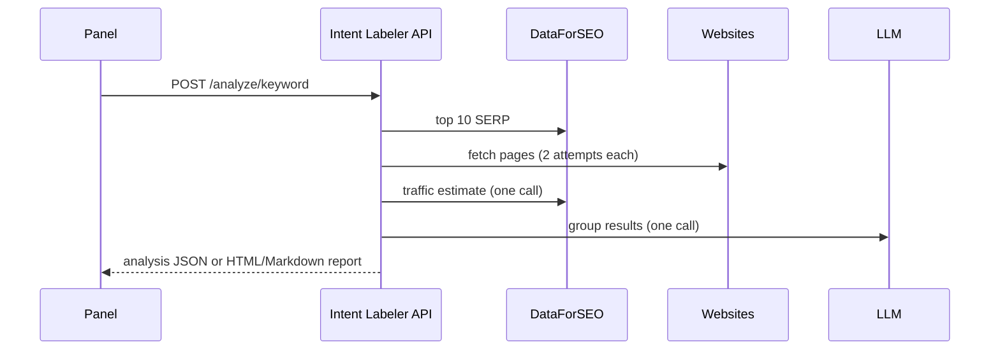

# HTTP API

Start: `uvicorn intent_labeler.api.app:app --port 8000`. OpenAPI UI: `/docs`.
Configuration comes from the environment (see `.env.example`). The API has no authentication - put it
behind your panel's auth or a reverse proxy.



All `POST /analyze/*` endpoints accept `?format=json|html|md` (default `json`). Errors in model output
or input return `422` with a message.

## `POST /analyze/keyword`

```json
{"keyword": "standing desk", "language": "en", "location_code": 2840, "depth": 10,
 "brief": "", "fetch_pages": true, "traffic": true}
```

## `POST /analyze/urls`

```json
{"urls": ["https://a.example/page", "https://b.example/page"], "keyword": "", "language": "en", "brief": ""}
```

Up to 50 URLs. Pages are always fetched.

## `POST /analyze/html-files`

Multipart form: `files` (repeatable, up to 50), optional query `language`, `keyword`, `brief`.
The file name stands in for the URL.

```bash
curl -F files=@page1.html -F files=@page2.html 'http://localhost:8000/analyze/html-files?format=html' > report.html
```

## `POST /analyze/snapshot`

```json
{"snapshot": { ...contents of snapshot.json... }, "brief": "", "fetch_pages": false}
```

## `GET /health`

`{"status": "ok"}`
