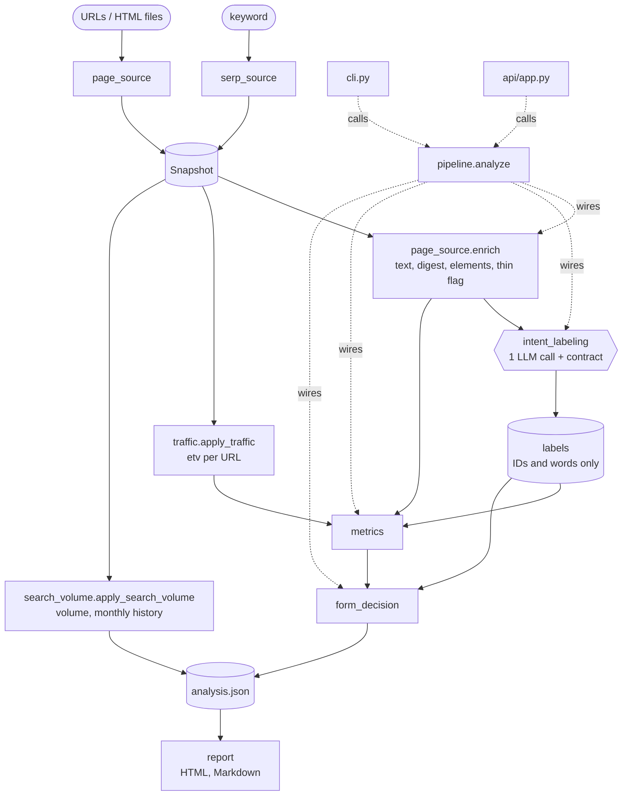
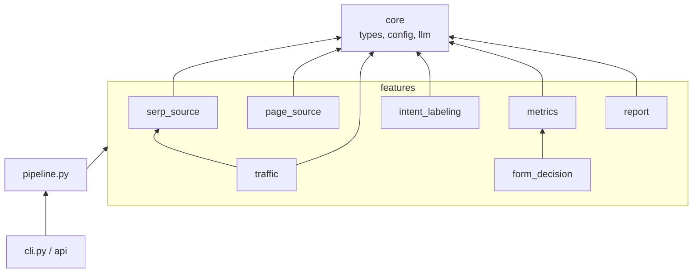
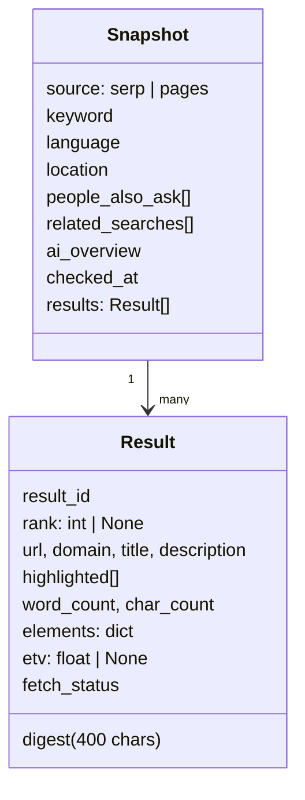

# Architecture

`pipeline.analyze()` wires the steps; `cli.py` and `api/app.py` call it. Traffic is applied by the
entry points before `analyze`, because it costs money and is optional.

## Import rules

Arrows point at what a module imports. `core` imports no feature; a feature imports another only
through its public `__init__` (`traffic` reuses `serp_source.credentials`, `form_decision` reuses
`metrics.percentile`).

## Data model

## Data contract

`analysis.json` (schema_version 1):

| Key | Producer | Content |
|---|---|---|
| `snapshot` | serp_source / page_source | input, including fetched word counts and `fetch_status` |
| `labels` | intent_labeling | model output after validation (+ `coverage_gap`, `basis` per intent) |
| `metrics` | metrics | per intent: coverage, answer/traffic share, ranks, words/chars, element prevalence; coverage of page types, heading themes, reader questions |
| `form` | form_decision | dominant intent, genre, reference length, warnings |
| `demand` | search_volume | volume, CPC, difficulty, monthly history, seasonality |
| `llm_cache_hit` | pipeline | whether the labels came from cache |

`Snapshot` and `Result` are defined in `core/types.py`. `fetch_status` is one of `not_fetched`, `ok`,
`thin`, `error: <ExceptionName> (<reason>)`.

## Feature boundaries

Each directory in `features/` is self-contained, exports its public functions from `__init__.py` and
has a single job and its own `README.md` with the public API and the reasons behind its rules
(index: [src/intent_labeler/features/README.md](../src/intent_labeler/features/README.md)).
See [AGENTS.md](../AGENTS.md) for the import rules.

## Extension points

| You want | Add |
|---|---|
| JS rendering (Crawl4AI, Playwright) | a fetcher `(url) -> html` passed to `page_source.enrich(fetcher=...)` / `analyze(fetcher=...)` |
| Another SERP provider | a module in `serp_source/` returning `Snapshot` |
| Other traffic data | set `Result.etv` (None = unknown) before `analyze` |
| Another LLM SDK | a `chat(system, user) -> str` function |
| New report | a module in `features/report/` reading `analysis.json` |
