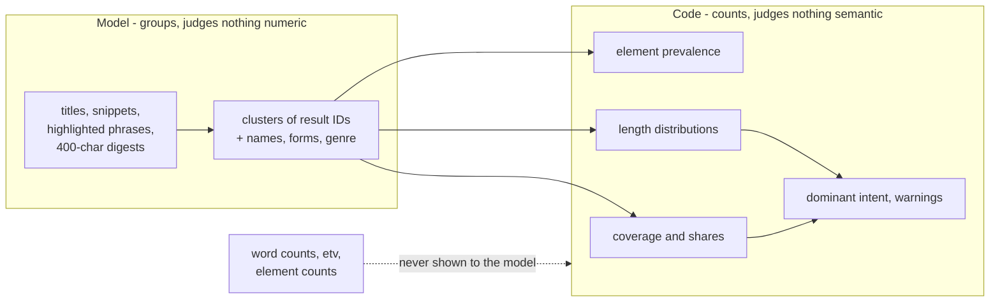
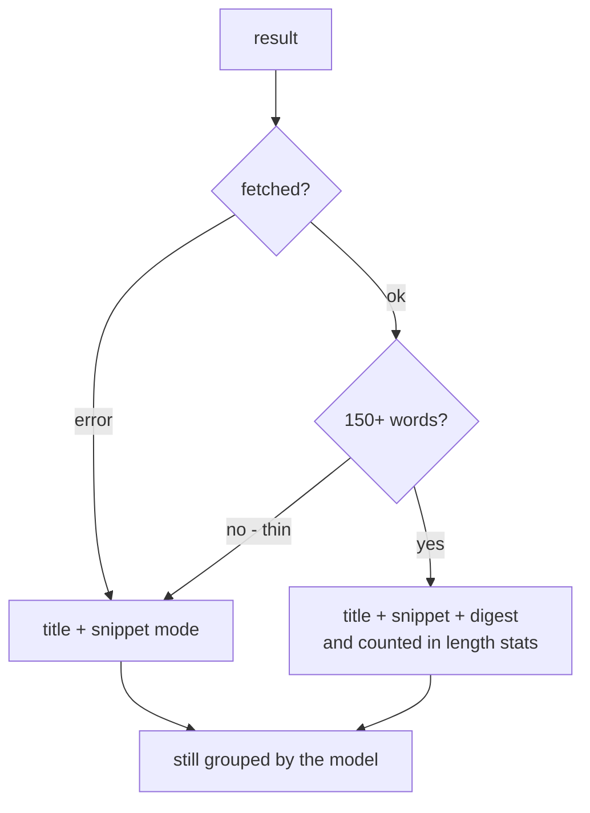
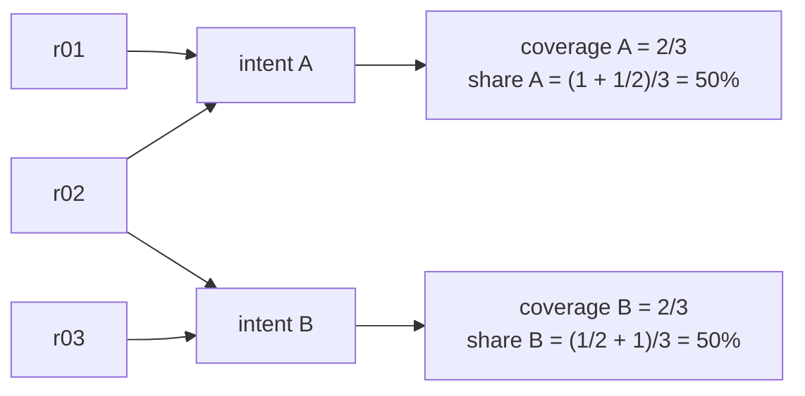
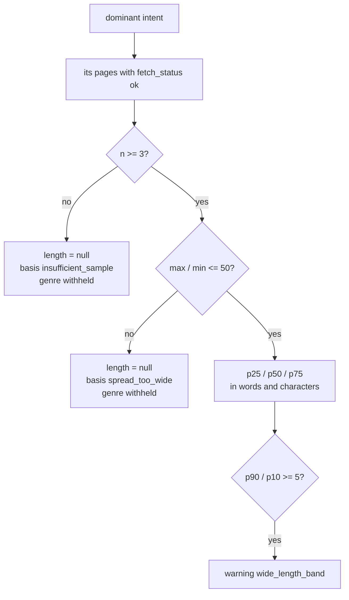
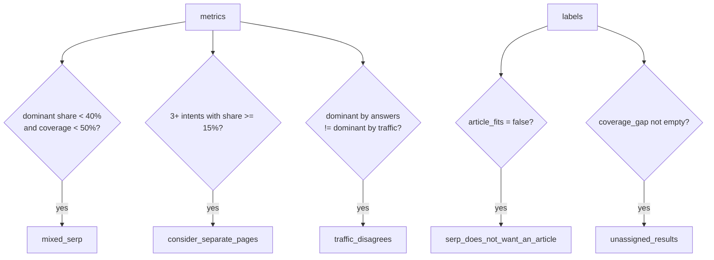
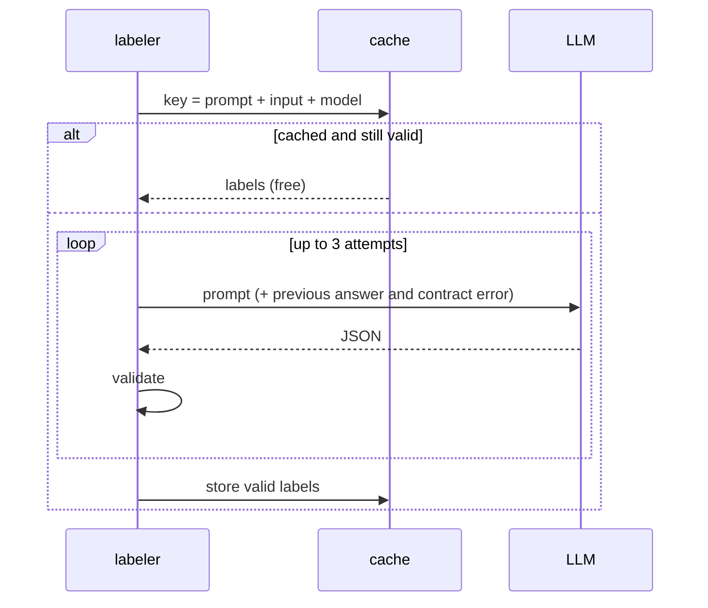

# Method

How Intent Labeler turns a results page (or a page set) into an intent map, a form and a reference
length - and why each rule exists. The rules come from running the method in production on
commissioned articles; where a measurement set a rule, it is quoted.

## 1. The question

Length and form used to be written into a content order before anyone looked at the search results:
"4,000-6,000 characters" for every topic, including topics where the answer is a table and two
sentences. Stretching such an answer is not quality, it is dilution. The results page answers the
question by itself: what people want, in what form, and how much of it.

## 2. The model groups, the code counts - that is the whole principle

An earlier version classified intent with hand-made rules - URL shapes, SERP blocks, question
vocabulary. It was removed on purpose: the weights were guesses that needed endless calibration, and
every new query brought patterns they did not know (`/listing?`, `/p/123`, a `popular_products`
block). Grouping is a language task, so a language model does it.

A model that sees numbers starts to judge them. So the payload contains no word counts and no traffic
(`test_payload_contains_no_numbers_for_the_model_to_copy`).

## 3. What the model reads

Per result: title, snippet (max 220 chars), up to 4 phrases the search engine highlighted, and a
**digest of the page**: up to 8 headings and the first 3 paragraphs, capped at 400 characters.

Why the digest, if there is a snippet: the snippet may be rewritten by the search engine and does not
say what the page actually offers. Ten digests of 400 characters are about as large as the snippets
themselves, so the prompt does not grow by an order of magnitude. Headings carry the most per
character - they say what the page offers, not how it sells itself.

A page that could not be fetched, or came back thin (below 150 words - a JavaScript shell or a bot
wall), falls back to title + snippet mode. **It does not drop out of the grouping.**

SERP features - People Also Ask, related searches, AI Overview - are context: they show what else
searchers want and often reveal an intent no organic result serves well.

## 4. Intents are emergent

There is no taxonomy and no fixed number of intents. The model names each goal it finds, in its own
words, as specific as the results justify: "solve puzzles with answers", "puzzles for kids",
"download a PDF set". A fixed list (informational / commercial / ...) would merge exactly the
distinctions a writer needs. The classic five survive only as an optional `intent_type` tag for
filtering, added after grouping; an unknown tag becomes null, never an error.

Every result must be placed. A result may sit in two clusters when the page genuinely serves both
goals. Results the model leaves out are neither retried into place nor dropped: they go to an explicit
`unassigned` intent (`basis: code_fallback`). In production, three retries with the full contract left
the same 3 of 19 results unassigned; dropping them would silently inflate the dominant share.

## 5. Form and genre are named freely

Each intent gets a `form`: the shape in which that intent is best answered, in a short free phrase.
The SERP as a whole gets an `expected_genre`. Neither is picked from a list.

Why: with a closed list (prose / list / table), a query whose top 10 were shop category pages forced
the model to answer "prose" - it had no word for a category listing. The answer was false and
undetectable. Named freely, "shop category listing" is visible, and `article_fits: false` turns it into
an explicit warning: this query may not be a topic for an article at all.

## 6. Page types, heading themes, content form

Besides intents, the model names each result's **page type** (every result exactly one) and the
**heading themes** the pages cover, each with the results covering it. Themes describe what a complete
answer is expected to address; they are not an outline and carry no order.

The **content form actually used on each page** is not asked of the model at all. Code counts it from
the HTML: tables, numbered and bulleted lists, images, embedded video, FAQ blocks (`
` or
`FAQPage` schema), forms and numeric inputs (calculators). Per intent the report gives the share of
measured pages containing each element. A tag either is there or is not - there is nothing to
interpret, so it is inventory for code, not semantics for a model.

Text is extracted with trafilatura when installed (`[extract]` extra), which removes menus, footers
and cookie walls far better than a plain parser and so gives honest word counts; without it a
standard-library parser keeps the core dependency-free. The element inventory always comes from the
raw HTML.

## 7. Coverage and two shares, all from data

`coverage` = results addressing the intent / all results, not split. On a heavily overlapping SERP
(one shop page = offer + guide + FAQ) intents can cover 94%, 82% and 76% of results at once. Coverage
answers "how many pages address this"; the shares below answer "how do the results divide".

| Share | Definition |
|---|---|
| `answer_share` | results serving the intent / all results, not weighted by rank |
| `traffic_share` | estimated traffic (`etv`) of the intent's results / traffic of all results with known `etv` |

A result assigned to two intents counts **half to each** in both shares, so shares add up to 100%.
Counting it twice once produced 146% on a real SERP.

`etv` comes from DataForSEO bulk traffic estimation: the whole URL's organic traffic from all its
keywords, one request for all results. Until August 2026 traffic share was modelled with a fixed CTR
curve (0.276 for position 1, ...) - our guessed weights in place of missing data. Measured is better
than modelled, so the curve was dropped.

**Zero is ambiguous.** `etv: 0` with zero known keywords means either "no traffic" or "the database
does not know this page" - a page ranking #5 with etv 0 is a documented case. Such pages are stored as
unknown and left out of both numerator and denominator, never counted as zero. Coverage is reported
(`traffic_known` of `results_total`).

When the two shares disagree it is a signal, not an error: a topic served by many weak pages versus a
topic served by one strong page.

## 8. The dominant intent is decided by code

Dominant = highest `answer_share` (ties: traffic share, then best rank). The intent dominant by traffic
is reported next to it; if they differ, the report warns and leaves the decision to a human.

## 9. Reference length

The distribution (p10, p25, p50, p75, p90, min, max; nearest-rank, so every value is a real page) of
the dominant intent's measured pages, in **words and characters**. Characters because publishers and
orders speak in characters; a words-to-characters multiplier would be one more guess.

Two guards return `null` with a reason instead of a number:

| Basis | When |
|---|---|
| `insufficient_sample` | fewer than 3 measured pages |
| `spread_too_wide` | longest / shortest > 50 |

The reference case: a dominant cluster with n=2 and lengths from 64 to 496,559 characters (7,759x) -
an EU legal act next to a twelve-word page. The median looked as confident as any other and let a bad
brief through. Under the same guards the `expected_genre` is withheld: a genre derived from an
unreliable cluster is a guess backed by a number.

Length is a description of the market, not a target. Measured on three orders, the same rule gave three
different answers: a shopping query (96% of traffic transactional, no guide in the top 10) cut the text
by 40%; an office-move query surfaced an 18% "quotes and costs" intent and *added* a section; a
legal-act query kept its length (+7%) because that market is long.

## 10. Warnings

| Code | When |
|---|---|
| `mixed_serp` | the dominant intent holds < 40% share **and** covers < 50% of results (overlap is not mixing) |
| `consider_separate_pages` | 3 or more intents hold ≥ 15% each |
| `traffic_disagrees` | dominant by answers ≠ dominant by traffic |
| `wide_length_band` | p90 / p10 ≥ 5 - look at pages one by one |
| `serp_does_not_want_an_article` | the model says an article cannot serve the main intent |
| `unassigned_results` | the model left results unplaced |

A measurement nobody reads at the point of decision is decoration. Warnings are in the JSON so the
next step (a brief, a panel) can block on them.

## 11. Page sets without a SERP

With `--urls` or uploaded HTML there are no ranks: the pages are a sample of what exists. Shares
describe the sample. Useful for auditing a site section or a competitor list.

## 12. Reliability and cost

- JSON that fails the contract goes back to the model with the exact error and its previous answer, up
  to 3 attempts. A repeated identical prompt tends to repeat the same mistake.
- Answers are cached by (prompt, input, model): re-running a snapshot is free and reproducible.
- A cheap reasoning model is enough. `openai/gpt-6-luna` with `reasoning_effort=low` labels a
  10-result SERP in about a minute for a fraction of a cent.

## 13. What this method does not do

It does not estimate CTR or difficulty, write outlines or content, or promise that matching the
dominant intent earns rankings.
