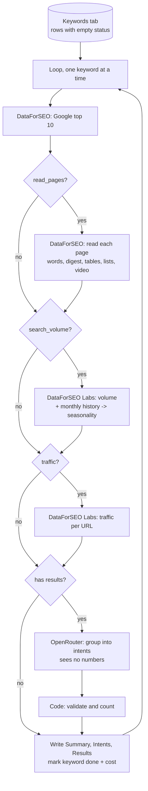

# Intent Labeler - n8n templates

Two templates, same method and the same Code nodes:

- [`intent-labeler-google-sheets.json`](intent-labeler-google-sheets.json) - batch: keywords in a Google Sheet, results written back with the official Google Sheets nodes. Described below.
- [`intent-labeler-webhook.json`](intent-labeler-webhook.json) - one keyword per request: POST to a webhook, get JSON back. Two lanes on one canvas: lane A with the DataForSEO community nodes (self-hosted only), lane B with HTTP Request nodes (works on n8n Cloud). Keep one. See [Webhook template](#webhook-template).

Creator Hub descriptions: [`creator-hub-description.md`](creator-hub-description.md) (Sheets) and [`creator-hub-description-webhook.md`](creator-hub-description-webhook.md).

## Google Sheets template

The Intent Labeler method as a ready n8n workflow. Put keywords in a Google Sheet, run the workflow,
and get back for every keyword: the search intents behind Google's top 10, the form each intent
expects, share of results and traffic per intent, reference length, content form on the winning pages,
search volume with seasonality, warnings, and the cost of the run.

**The model groups, the code counts.** A low-cost model (through OpenRouter) only groups result IDs and
names intents; every number is computed in the workflow's Code nodes, with the same rules as the Python
library (`src/intent_labeler/features/metrics` and `form_decision`).

- Workflow: [`intent-labeler-google-sheets.json`](intent-labeler-google-sheets.json) - import it in n8n
  (Workflows -> Import from file).
- Template sheet: https://docs.google.com/spreadsheets/d/1jgeI2wWxi5eD2d89ztmebuPbdXxdeBEOK-HXDM6FJJE/copy
  (make a copy; it already contains three analysed example keywords).

## Flow



## Setup

1. Make a copy of the template sheet and paste its URL into **Config -> spreadsheet_url**.
2. Credentials:
   - **DataForSEO** - HTTP Basic Auth with your API login and API password (DataForSEO dashboard ->
     API access). Referral link: https://skq.pl/data4seo
   - **OpenRouter** - OpenRouter credential with your key.
   - **Google Sheets OAuth2** - on the Google Sheets nodes: "Read Keywords tab", the three "Write" nodes and "Mark keyword as done" (matched by `row_number`).
3. Add keywords to the **Keywords** tab: `keyword`, `country_code` (DataForSEO location code: 2840
   United States, 2826 United Kingdom, 2616 Poland, 2276 Germany, 2250 France, 2380 Italy) and
   `language_code` (`en`, `pl`, `de`...). Leave `status` empty.
4. Execute the workflow. Each processed row gets `status` (`done` or `error`), `processed_at` and
   `cost_usd`. Clear the status to run a keyword again. `max_keywords` in Config limits one run.

## Config

| Field | Default | Meaning |
|---|---|---|
| `spreadsheet_url` | template | your copy of the sheet |
| `model` | `openai/gpt-6-luna` | any OpenRouter model; reasoning is switched off |
| `read_pages` | true | read every page through DataForSEO content parsing |
| `search_volume` | true | volume, CPC, difficulty, seasonality |
| `traffic` | true | estimated traffic per URL |
| `max_keywords` | 10 | keywords per run |
| `system_prompt` | the library prompt | the grouping instructions; change with care |

## Cost per keyword (measured September 2026)

| Step | Price |
|---|---|
| Google top 10, live | $0.002 |
| Read ten pages | about $0.0015 |
| Search volume and 8 years of history | about $0.012 |
| Traffic per URL | about $0.013 |
| Grouping with `openai/gpt-6-luna` | about $0.001 |
| **Full run** | **about $0.03** |

SERP and grouping only (all switches off): about $0.003. The actual cost of every keyword is written to
the sheet from the services' own answers.

## Sheet columns

- **Summary** (one row per keyword): date, keyword, country_code, language_code, model, results,
  pages_read, dominant_intent, dominant_form, dominant_share, expected_genre, article_fits,
  reference_length_words, length_basis, search_volume, cpc, seasonality_index, peak_month, warnings,
  summary, cost_dataforseo_usd, cost_openrouter_usd, tokens_in, tokens_out
- **Intents** (one row per intent): date, keyword, intent, intent_type, searcher_goal, form, coverage,
  share, traffic_share, ranks, median_words, evidence
- **Results** (one row per result): date, keyword, rank, url, title, domain, intents, words,
  fetch_status, traffic_etv, tables, lists, images, videos

## Differences from the Python library

- One model attempt per keyword. Result IDs the model invents are dropped (the library sends the answer
  back for correction instead); results it leaves out go to "Unassigned results", as in the library.
- Pages are read through DataForSEO content parsing (the library fetches them itself, with trafilatura).
- Everything else - coverage, split shares, unknown traffic left out, length guards, warnings,
  seasonality - follows the same rules.

## Files

- `intent-labeler-google-sheets.json` - the workflow export (credentials are references; set your own).
- `creator-hub-description.md` - the description submitted to the n8n Creator Hub (same text as the
  yellow sticky note).
- `README.md` - this file.

## Updating the export

Edit the live workflow in n8n, then run `N8N_API_KEY=... python scripts/export_n8n_template.py`. It
strips credential IDs, account names and node IDs, and refuses to write the file if a sheet ID other than
the public template or an email address is left in it.

## Webhook template

```bash
curl -X POST https://YOUR-N8N/webhook/intent-labeler-http \
  -H 'Content-Type: application/json' \
  -d '{"keyword": "standing desk", "location_name": "United States", "language_name": "English"}'
```

Lane A listens on `/webhook/intent-labeler-nodes`, lane B on `/webhook/intent-labeler-http`. Optional body fields: `model`, `read_pages`, `search_volume`, `traffic` (booleans default to true). Location and language use DataForSEO names ("Poland", "Polish").

The answer is one JSON object: `decision` (dominant intent, form, share, reference length and its basis, genre, warnings), `summary`, `demand` (volume, CPC, difficulty, seasonality), `intents`, `results` (words, fetch status, traffic, content elements, intents per URL), `serp_features`, `cost_usd` (DataForSEO, OpenRouter, total and per step, as reported by the APIs) and `tokens`.

Credentials: DataForSEO API (lane A) or HTTP Basic Auth with the DataForSEO API login and password (lane B), and OpenRouter for both. OpenRouter stays an HTTP Request in both lanes, because the request switches reasoning off and asks for the usage cost.

