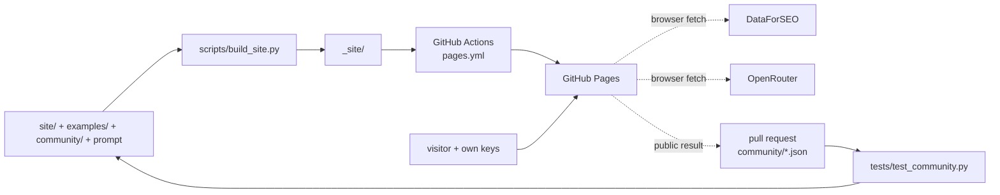

# site

The GitHub Pages site: https://romek-rozen.github.io/intent-labeler/

Static on purpose - no server and no API key of ours. The "Try it" playground runs in the visitor's
browser on the visitor's own keys:

- **DataForSEO** (optional): live Google top 10 for a chosen country and language ($0.002), the ten
  pages read through OnPage `content_parsing/live` with `markdown_view: true` ($0.00015 per page), and
  an optional traffic estimate per URL (about $0.013 - the most expensive step). DataForSEO allows
  browser calls (CORS `*`). From the markdown the browser computes words, characters, headings, the
  400-char digest and tables/lists/images/video. Bot-protected pages come back empty and are marked
  `error`/`thin`, exactly like in the Python version.
- **OpenRouter**: the same system prompt as the library; coverage, split shares and traffic shares are
  computed in JavaScript with the same rules as `features/metrics`.
- Keys stay in the tab; only with "remember" are they kept in the browser's local storage.
- Models: seven low-cost OpenRouter models, benchmarked on two real SERPs with reasoning switched
  off ($0.0003-$0.0022 per query). The list and measured costs live in `MODELS` in `app.js`.
- A live cost estimate under the price table updates with every option.

**Public results** go through GitHub, not through a backend: with "Public" selected, the result page
offers a link that opens GitHub's "new file" form for `community/<market>-<query>-<date>.json`,
pre-filled with the record (no keys). GitHub forks and opens a pull request; `tests/test_community.py`
checks the file in CI; once merged, `build_site.py` puts it in the "Shared by the community" gallery.

Build locally: `python scripts/build_site.py && python -m http.server -d _site 8000`.
The workflow rebuilds on every push to `site/`, `examples/` or the prompt.
