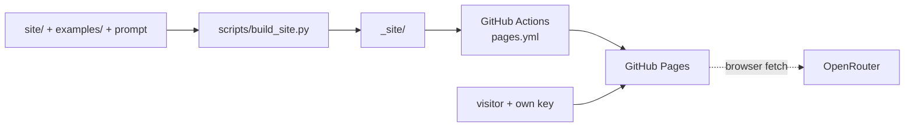

# site

The GitHub Pages site: https://romek-rozen.github.io/intent-labeler/

Static on purpose - no server and no API key of ours. The "Try it" playground calls OpenRouter from
the visitor's browser with the visitor's own key (kept only in their browser, and only if they tick
"remember"). It sends the same system prompt as the library and computes coverage and split shares
in JavaScript with the same rules as `features/metrics`. It does not fetch pages (browsers block
cross-site requests), so it works from titles and snippets and reports no length.

Build locally: `python scripts/build_site.py && python -m http.server -d _site 8000`.
The workflow rebuilds on every push to `site/`, `examples/` or the prompt.
