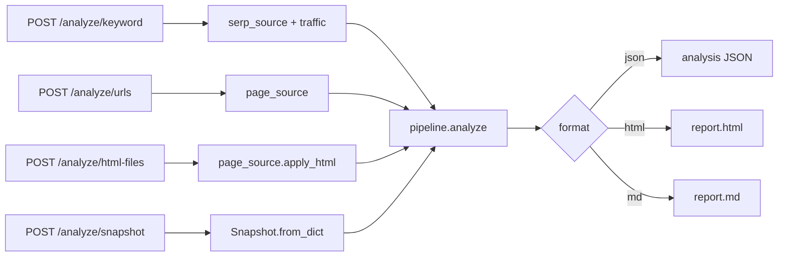

# api

FastAPI layer over `pipeline.analyze` - no logic of its own. Endpoints and payloads:
[docs/API.md](../../../docs/API.md). Install with the `[api]` extra; run
`uvicorn intent_labeler.api.app:app`. No authentication: put it behind your panel or a proxy.

## Flow

