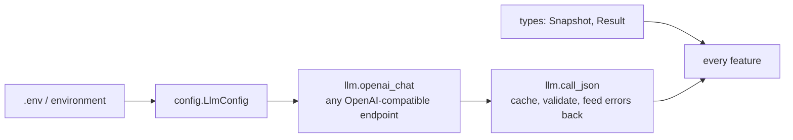

# core

Shared plumbing. **Knows no feature** - features import `core`, never the other way round.

## Flow

| Module | Holds |
|---|---|
| `types.py` | `Result`, `Snapshot` dataclasses; `to_dict` / `from_dict` (unknown keys ignored) |
| `config.py` | `LlmConfig.from_env()`, minimal `.env` loader (environment wins) |
| `llm.py` | `openai_chat(config)` for any OpenAI-compatible endpoint; `call_json(...)` with cache, validation and error feedback |

`call_json` sends a failed answer back to the model with the exact contract error (up to 3 attempts)
and caches valid answers by prompt + input + `cache_salt` (the model name).
`INTENT_LLM_TEMPERATURE=none` omits temperature for reasoning models that reject it.
