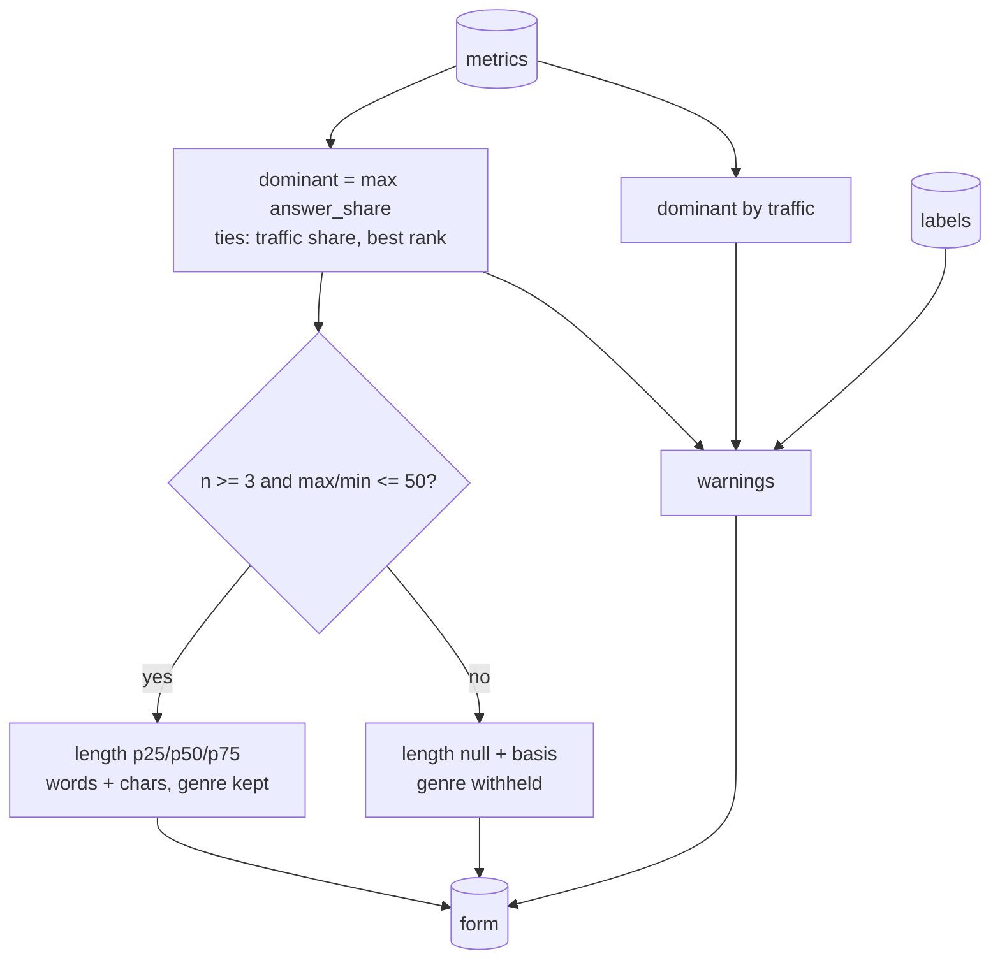

# form_decision

Turns metrics into the recommendation: which intent dominates, the reference length, the genre, and
the warnings a human must see.

## Flow

## Public API

`decide(snapshot, labels, metrics) -> dict`

## Output

| Key | Meaning |
|---|---|
| `dominant_intent_*` | id, title, form, answer share, coverage |
| `dominant_by_traffic_id` | intent with the highest traffic share |
| `top_page_type` | most common page type |
| `expected_genre` / `expected_genre_withheld` | genre from the model, withheld when the sample is unreliable |
| `article_fits` | model's judgement whether an article can serve the main intent |
| `length_words`, `length_chars` | p25/p50/p75 of the dominant intent's measured pages, or `null` |
| `length_basis` | `median_of_dominant_intent_pages`, `insufficient_sample`, `spread_too_wide` |
| `warnings[]` | `{code, message}` |

## Rules and why

- **Dominance by code**: highest `answer_share`, ties by traffic share, then best rank.
- **No number without a sample**: fewer than 3 measured pages, or max/min > 50, gives `null` and a
  reason. Reference case: n=2, 64 vs 496,559 characters (7,759x) - that median let a bad brief through.
  The genre is withheld under the same guards.
- **Warnings**: `mixed_serp` (share < 40% and coverage < 50%), `consider_separate_pages` (3+ intents
  with share >= 15%), `traffic_disagrees`, `wide_length_band` (p90/p10 >= 5),
  `serp_does_not_want_an_article`, `unassigned_results`.
- Thresholds are module constants at the top of `decide.py`; change them there, with a reason.

## Tests

`tests/test_metrics_and_form.py`.
