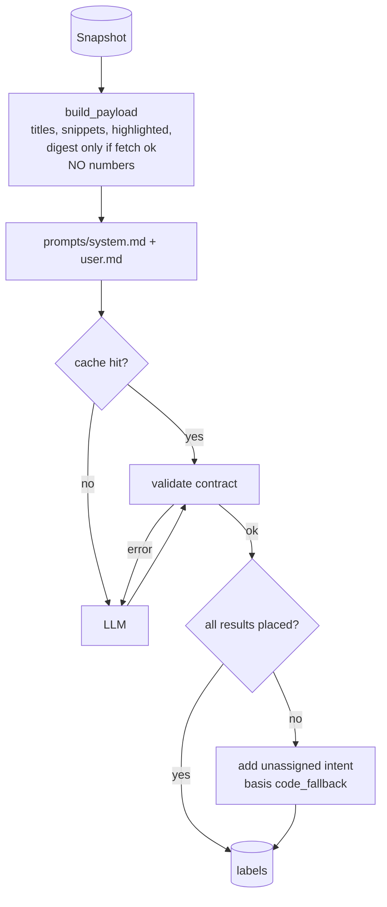

# intent_labeling

The only semantic step and the only LLM call: groups results into intents and names forms, genre,
page types and heading themes. Returns IDs and words - never numbers.

## Flow

## Public API

| Function | Does |
|---|---|
| `label(snapshot, chat, brief="", cache_dir=None, cache_salt="")` | one LLM call -> validated labels, cache hit flag |
| `build_payload(snapshot, brief)` | exactly what the model sees |
| `validate(data, result_ids)` | the contract; raises `ValueError` with a message the model gets back |
| `UNASSIGNED_INTENT_ID` | id of the code-made fallback intent |

## Files

- `prompts/system.md`, `prompts/user.md` - the prompt. Input goes in through `{{INPUT_JSON}}` with
  `str.replace`. **No prompt text in Python.**
- `contract.py` - validation and normalisation.
- `labeler.py` - payload and call.

## What the model reads

Per result: title, snippet (220 chars), highlighted phrases, and the 400-char `digest` (only for
pages with `fetch_status == "ok"`; others are read from title + snippet). Plus SERP features and the
optional brief. **No word counts, characters, traffic or elements** - a model that sees numbers starts
judging them (`test_payload_contains_no_numbers_for_the_model_to_copy`).

## What it returns (after validation)

`intents[]` (`intent_id`, `title`, `searcher_goal`, free `form`, optional `intent_type` tag,
`result_ids`, `evidence`, `basis`), `expected_genre`, `article_fits`, `page_types[]`,
`heading_themes[]`, `competitor_brands`, `subject_brands`, `ai_overview_signal`,
`useful_elements[]`, `avoid[]`, `reader_questions[]`, `summary`, `coverage_gap`.

## Rules and why

- **Emergent intents, free-form forms and genres. No closed lists.** A closed form list once forced
  "prose" for a SERP of shop category pages - false and undetectable. `intent_type` is only a filter
  tag; an unknown value becomes `null`, never an error.
- **The model does not pick the dominant intent** - `dominant_intent_id` is dropped; `form_decision`
  decides from shares.
- **Unknown `result_ids` are rejected**; the error goes back to the model with its previous answer
  (`core/llm.py`, up to 3 attempts).
- **Unplaced results go to `unassigned`** (`basis: code_fallback`), never dropped: three retries did
  not place the same 3 of 19 results in production.
- Wrong interpretation -> change the prompt. Wrong format -> change the contract.

## Tests

`tests/test_intent_labeling.py` (fake chat, no network).
