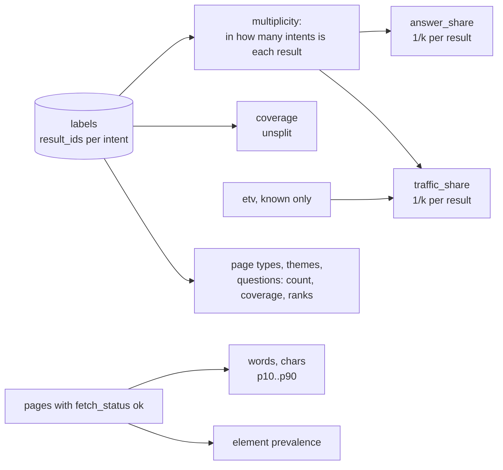

# metrics

Every number in the report. Pure arithmetic on the labeler's `result_ids` and the fetched page data.

## Flow

## Public API

| Function | Does |
|---|---|
| `measure(snapshot, labels)` | all metrics as one dict |
| `distribution(values)` | n, min, p10, p25, p50, p75, p90, max |
| `percentile(values, p)` | nearest-rank percentile |

## Per intent

| Key | Definition |
|---|---|
| `coverage` | results addressing the intent / all results - not split |
| `answer_share` | same, but a result in k intents counts 1/k - shares add up to 100% |
| `traffic_share` | known `etv` of the intent's results (split the same way) / all known `etv`; `None` without data |
| `ranks`, `best_rank`, `top3_count` | from `Result.rank` |
| `words`, `chars` | distributions over pages with `fetch_status == "ok"` |
| `elements` | share of measured pages containing each element, plus `n` |

Also: `page_types`, `heading_themes`, `reader_questions` with `count`, `coverage`, `ranks`;
`shared_results`, `traffic_known`, `results_fetched`.

## Rules and why

- **Coverage and share are both needed.** On an overlapping SERP intents covered 94%, 82% and 76% of
  results; split shares showed ~25% each and would call the SERP mixed.
- **Split for shared results**: counting a result twice once produced 146%.
- **Nearest-rank percentiles**: with 8-10 pages interpolation fakes precision; every value is a real page.
- **Unknown is not zero**: thin/failed pages leave length stats, unknown traffic leaves both sides of
  the traffic fraction.

## Tests

`tests/test_metrics_and_form.py`.
