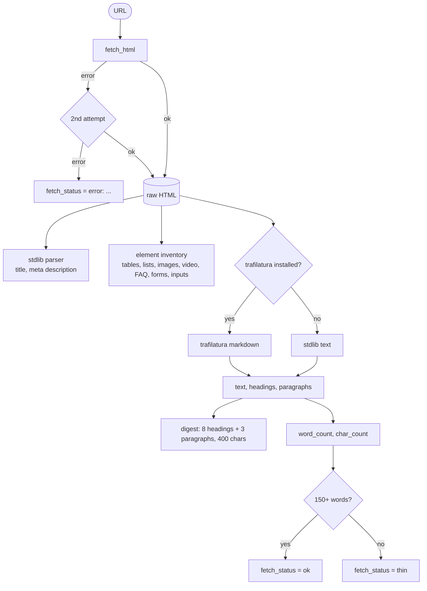

# page_source

Builds `Result`s from URLs or raw HTML and fills them from the page itself: text, a short digest,
length, and the structural form of the content.

## Flow

## Public API

| Function | Does |
|---|---|
| `snapshot_from_urls(urls, keyword="", language="en")` | page set without a SERP (`source="pages"`, no ranks) |
| `enrich(snapshot, fetcher=fetch_html, workers=8)` | download all pages concurrently and fill them |
| `apply_html(result, html)` | fill one result from HTML you already have (uploads, caches) |
| `extract_html(html, use_trafilatura=True)` | the extraction itself |

`fetcher` is any `(url) -> html` function - plug in Crawl4AI or Playwright for JavaScript pages.

## What gets filled

| Field | How |
|---|---|
| `word_count`, `char_count` | from extracted text; characters because publishers count characters |
| `digest` | up to 8 headings + first 3 paragraphs, max 400 chars - what the labeler reads |
| `headings`, `excerpt` | for reports |
| `elements` | counts of tables, ordered/unordered lists, images, videos, FAQ, forms, numeric inputs |
| `extractor` | `trafilatura` or `stdlib` |
| `fetch_status` | `ok`, `thin` (< 150 words), `error: <Exception> (<reason>)` |

## Rules and why

- **Trafilatura when installed** (`[extract]` extra): it strips menus, footers and cookie walls, so
  word counts are honest. The stdlib parser keeps the core dependency-free.
- **Element inventory always from raw HTML** - a tag is there or it is not; counting it is code's job.
  Nav, header and footer are skipped; `<form>` and number/range `<input>` are counted even inside
  skipped regions (calculators live in forms); search boxes are ignored.
- **Thin pages** (< 150 words) are JavaScript shells or bot walls. Measured on a live SERP: YouTube,
  Costco and a brand site returned 26-35 words and hid a usable median. They stay in the analysis but
  out of length statistics, and the labeler reads them in title + snippet mode.
- **A failed page never disappears.** Two fetch attempts: five of nine pages once failed with a
  transient `URLError` that a re-fetch did not reproduce.

## Tests

`tests/test_sources.py` - extraction, digest cap, element inventory, thin flag, retries, trafilatura
(skipped when not installed).
