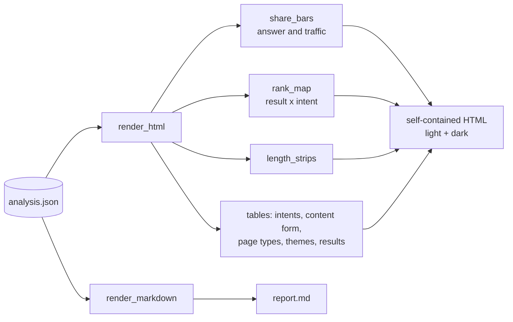

# report

Renders an analysis dict (the `analysis.json` shape) for people. Reads data, computes nothing new.

## Flow

## Public API

| Function | Output |
|---|---|
| `render_html(analysis)` | self-contained HTML page: no JS, no external assets, light + dark mode |
| `render_markdown(analysis)` | Markdown for terminals, tickets and PRs |

## Files

- `charts.py` - inline SVG: `share_bars` (answer or traffic share), `rank_map` (result x intent dot
  matrix), `length_strips` (words per page per intent with median tick). Hover = SVG `<title>`.
- `palette.py` - 8 categorical colours in fixed order, light and dark steps. Colour follows the
  intent's position in the labels, never its share. The `unassigned` intent is grey.
- `html.py`, `markdown.py` - page layout and tables.

## Rules

- Every chart has a table view with the same numbers.
- Text uses text colours, never the series colour.
- Pages that are thin or failed are left out of length charts, matching `metrics`.
- New output format = new module here; do not add formatting to other features.
- After changing charts run `python scripts/build_examples.py` to refresh `docs/`.

## Tests

`tests/test_pipeline_and_api.py::test_pipeline_output_is_json_and_renders`.
