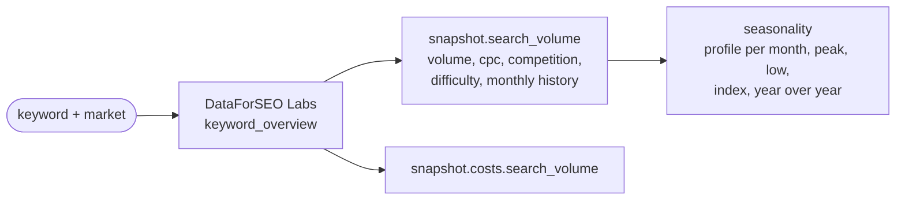

# search_volume

Search volume, CPC, keyword difficulty and seasonality of the analysed keyword, from DataForSEO Labs
`keyword_overview` (one call, about $0.012).

## Flow

## Public API

| Function | Does |
|---|---|
| `apply_search_volume(snapshot, location_code, language_code)` | fill `snapshot.search_volume` and its cost |
| `parse_response(payload)` | normalise a raw response |
| `seasonality(monthly)` | profile, peak and low month, seasonality index, year-over-year change |

## Rules and why

- **Labs, not Google Ads.** Same volume and CPC on a measured keyword, but $0.012 and 95 months of
  history against $0.09 and 12 months. Seasonality needs the history.
- **Seasonality is arithmetic**, not a model's opinion: calendar-month means over the last three years
  relative to the overall mean. Index = best month / worst month.
- Months with unknown volume are left out, never counted as zero.
- The volume is context for the report; it does not change the intent reading.

## Tests

`tests/test_search_volume.py` (offline).
