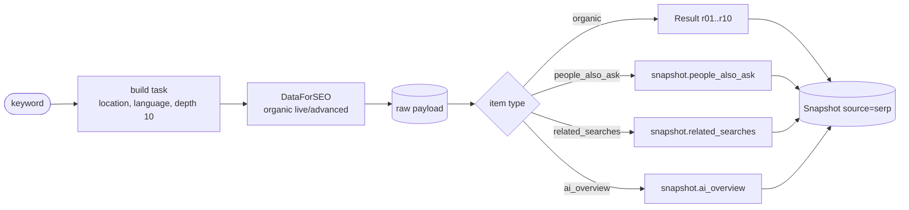

# serp_source

Turns a keyword into a `Snapshot` of Google's organic results via DataForSEO
(`serp/google/organic/live/advanced`).

## Flow

## Public API

| Function | Does |
|---|---|
| `fetch_snapshot(keyword, location_code=2840, language_code="en", depth=10)` | live call + normalisation |
| `snapshot_from_dataforseo(payload, language, max_results=10)` | normalise a saved raw response (offline) |
| `credentials()` | Basic-auth token; shared with `traffic` |

## Output

`Snapshot(source="serp")` with `Result`s `r01..r10` carrying `rank`, `url`, `domain`, `title`,
`description` and up to 4 `highlighted` phrases. People Also Ask, related searches, AI Overview text
and SERP item types are kept on the snapshot as context for the labeler - they are not counted.

## Rules

- Only `type == "organic"` items become results. Ads, shopping and video packs are SERP features.
- Default depth is 10: the method reads Google's first page.
- Location codes: 2616 Poland, 2840 United States, 2826 United Kingdom.
- Needs `DATAFORSEO_USERNAME` / `DATAFORSEO_PASSWORD`.

## Tests

`tests/test_sources.py::test_dataforseo_payload_is_normalised` (offline, fixture payload).
