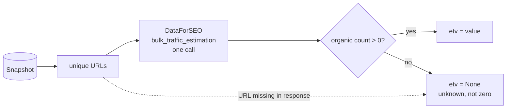

# traffic

Fills `Result.etv` - estimated monthly organic traffic of each URL - from DataForSEO
`dataforseo_labs/google/bulk_traffic_estimation`. One request for all results (up to 1000 targets,
billed per call).

## Flow

## Public API

| Function | Does |
|---|---|
| `apply_traffic(snapshot, location_code, language_code, fetcher=fetch_raw)` | set `etv` on every result |
| `parse_response(payload)` | `{url: etv or None}` from a raw response |

## What the number means

`etv` is the traffic of the **whole URL from all its keywords**, not traffic from this query - the
same thing SEO tools show in their traffic column.

## Zero is ambiguous - the most important rule here

`etv: 0` with `count: 0` means either "no traffic" or "the database does not know this page"; the
response does not tell them apart. A page ranking #5 with etv 0 is a documented case. So a page with
zero known keywords gets `etv = None` (unknown) and `metrics` leaves it out of both numerator and
denominator. Never turn `None` into `0`.

## Tests

`tests/test_sources.py::test_traffic_zero_with_no_keywords_is_unknown` (offline).
